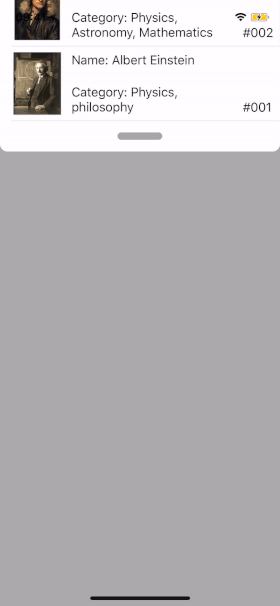

<p align="center">

</p>

<p align="center">

</p>

# TDSwipeSheet

`TDSwipeSheet` is a simple and easy to integrate solution for presenting UIViewController or any view in bottom or top sheet. We handle all the hard work for you - transitions, gestures, taps and more are all automatically provided by the library. Styling, however, is intentionally left out, allowing you to integrate your own design with ease.

The delegate of a `TDSwipeSheetViewController` object must adopt the `TDSwipeSheetViewControllerDelegate` protocol. Optional methods of the protocol allow the delegate to manage gestures, animations, and events such as changing the orientation and reaching the limit.

With the help of the delegate, you can get information about moving the view,
reaching the limits, change the animation and get the orientation of the object.

`TDSwipeSheetViewController+Theme` - the category of the `TDSwipeSheetViewController` class that allows you to customize, change its appearance and change the appearance of the SwipeSheetin every possible way.

Сategory includes presets with standard light and dark themes.
You can also create a custom preset, as shown in the demo application.

>Adding TDSwipeSheetView to your view controller:

```objective-c
- (void)addSheet {

    TDSwipeSheetViewController *swipeSheetViewController = [TDSwipeSheetViewController new];
    swipeSheetViewController.delegate = self;
    SCAnyElement *yourOwnCustomView = [SCAnyElement new];
    yourOwnCustomView.backgroundColor = UIColor.anyColor;

    /// Your view will be added to the entire size of TDSwipeSheetViewController.
    [swipeSheetViewController addCustomView:yourOwnCustomView];

    [swipeSheetViewController setUpDarkTheme];
    [swipeSheetViewController presentswipeSheetOnViewController:self];
    [yourOwnCustomView setUpIfNeeded];
}
```

<aside class="notice">
Also you can create a view controller that will be the heir from the TDSwipeSheetView, an example can be seen in the demo app. 
</aside>
